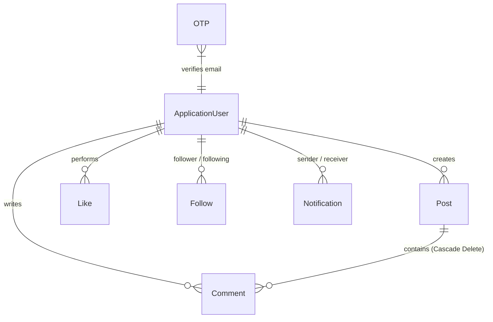

# Blog_Website

A social blogging platform built with ASP.NET Core 9.0 MVC, Entity Framework Core, and SignalR. The application handles user accounts with OTP-based email verification, post publishing with granular visibility controls, polymorphic liking, nested comments, user follow dynamics, real-time notifications, and soft account deletion.

---

## Technical Stack

* **Framework:** ASP.NET Core 9.0 MVC (`net9.0`)
* **ORM & Database:** Entity Framework Core 9.0.6, SQL Server (`Microsoft.EntityFrameworkCore.SqlServer`)
* **Authentication & Identity:** ASP.NET Core Identity (`Microsoft.AspNetCore.Identity.EntityFrameworkCore`)
* **Real-Time Engine:** ASP.NET Core SignalR
* **Email & Background Processing:** System.Net.Mail (SMTP), Hangfire integrations
* **Rate Limiting:** ASP.NET Core RateLimiter Middleware
* **Session Management:** ASP.NET Core Session (`HttpContext.Session` with `Newtonsoft.Json`)

---

## Architecture & Project Structure

The project follows a layered MVC pattern with an explicit Service Layer separating business logic from HTTP Controllers and Data Access layers.

```
Blog_Website/
├── Controllers/              # Web entry points (Account, Post, Comment, Like, Follow, Profile, Notification, Search)
├── Services/                 # Business logic interfaces & implementations
│   ├── IServices/            # Abstractions (IPostService, IAccountService, INotificationService, etc.)
│   └── Implementation files  # PostService, AccountService, NotificationService, EmailService, etc.
├── Models/
│   ├── Data/                 # AppDbContext configuration & EF Core mapping
│   └── Entities/             # Domain entities (ApplicationUser, Post, Comment, Like, Follow, Notification, OTP)
├── ViewModel/                # Feature-scoped DTOs and view models
├── Middleware/               # DeleteAccountMiddleware for enforcing soft-deletion security
├── Hubs/                     # NotificationHub (SignalR WebSocket endpoint)
├── CustomValidation/         # Custom attributes and Identity user validators
├── ViewComponents/           # NotificationViewComponent for paged real-time UI components
├── Generics/                 # Generic PageResult<T> pagination wrapper
├── Helpers/                  # TimeFormatter (Instagram-style dynamic timestamping)
└── wwwroot/                  # Static file storage (images/post, images/profile)
```

---

## Database & Entity Relationships

The data model uses SQL Server managed via EF Core Code-First migrations.



### Important Relationships & Schema Rules

1. **Polymorphic Liking System (`Like`)**:
   * Uses `TargetId` (`int`) and `TargetType` (`LikeTargetType` enum: `Post` / `Comment`) instead of dedicated join tables for each likable entity.
2. **Self-Referencing Follow Relation (`Follow`)**:
   * Configured in `AppDbContext` with explicit FK relationships: `Follower` (`DeleteBehavior.NoAction`) and `Following` (`DeleteBehavior.Restrict`).
   * Unique composite index on `(FollowerId, FollowingId)` to prevent duplicate follow entries.
3. **Notification System (`Notification`)**:
   * Dual foreign keys to `ApplicationUser` (`SenderId` and `ReceiverId`) set to `DeleteBehavior.SetNull`. Uses generic `Type` and `TargetId` fields for navigation routing.
4. **Soft Delete (`ApplicationUser`)**:
   * Entities include an `IsDeleted` boolean flag. Relational queries across posts, comments, likes, and followers filter out soft-deleted users.

---

## Authentication & Security

* **Custom Identity Validation**: Enforces custom username rules via `CustomUserValidator` (regex allowing Arabic/English alphanumeric characters and `_.-`) alongside custom age restrictions (`BirthdateValidation` >= 14 years).
* **Two-Step Registration with OTP**:
  1. Registration form payload validated and stored temporarily in `HttpContext.Session["RegisterData"]`.
  2. System generates a 6-digit numeric OTP with a 5-minute expiration saved in the `OTPs` table and sent via SMTP.
  3. Upon OTP verification, `AccountService.CreateAsync` persists the user and signs them in via `SignInManager`.
* **Rate-Limited Resend Endpoint**: Resending verification codes is protected by ASP.NET Core RateLimiter (`otpResendPolicy`), restricting clients to 1 request per minute.
* **Soft Delete Middleware (`DeleteAccountMiddleware`)**: Intercepts authenticated requests. If `user.IsDeleted == true`, the middleware signs out the user immediately and redirects them to `/Account/Login`.
* **Security Stamp Invalidation**: Calls `UpdateSecurityStampAsync` upon password changes and account deletion to reject stale cookie authentication tokens.

---

## Core Backend Workflows

### 1. Feed Generation (`GetFriendsPosts`)
Combines user-authored content, public posts, and private posts from followed users into a single chronological stream using LINQ:
```csharp
var posts = await _context.Posts
    .AsNoTracking()
    .Where(post => !post.ApplicationUser.IsDeleted &&
        (post.UserId == currentUserId || post.Public || (!post.Public && post.Visible && followedUsersId.Contains(post.UserId))))
    .OrderByDescending(x => x.CreatedDate)
    .Select(x => new DisplayPostViewModel { ... })
    .ToListAsync();
```

### 2. Atomic Database & File Operations
`PostService` utilizes explicit database transactions (`BeginTransactionAsync`) when creating, updating, or deleting posts with media. If image processing or database writes fail, the transaction rolls back safely to avoid orphan records or unlinked disk files.

### 3. Parallel Notification Dispatching
When a user publishes a visible post, `PostService` retrieves followers and dispatches database creation tasks in parallel using `Task.WhenAll`, avoiding sequential query bottlenecks:
```csharp
var tasks = followers
    .Where(x => !string.IsNullOrEmpty(x.Id))
    .Select(follower => _notifiService.CreateAsync(new AddNotificationViewModel { ... }));

await Task.WhenAll(tasks);
```

### 4. Real-Time Notification Hub
`NotificationService` persists notification records to SQL Server and broadcasts them over SignalR WebSockets:
```csharp
await _hubContext.Clients.User(notification.ReceiverId!)
    .SendAsync("ReceiveNotification", notification.Title, notification.RedirectUrl);
```

---

## Key Technical Decisions

* **N+1 Query Prevention**: Feed and post query projections use EF Core inline subqueries (`.Select()`) to compute `IsLikedByCurrentUser` and `TempLikesCount` in a single SQL execution.
* **AsNoTracking Strategy**: Applied across search, user feed, and gallery queries to eliminate EF Core context tracking overhead on read-only operations.
* **Generic Pagination**: Clean pagination metadata encapsulated in `PageResult<T>` for paged user post listings.

---

## Setup & Configuration

### Prerequisites
* [.NET 9.0 SDK](https://dotnet.microsoft.com/download/dotnet/9.0)
* SQL Server (LocalDB or full SQL Server instance)

### Configuration
Update `appsettings.json` with your local database connection string and SMTP server settings:

```json
{
  "ConnectionStrings": {
    "constr": "Server=YOUR_SERVER; Database=BlogWebsite; Trusted_Connection=True; TrustServerCertificate=True"
  },
  "MailSettings": {
    "Email": "your-email@gmail.com",
    "Password": "your-app-password",
    "DisplayName": "Blog Website",
    "Host": "smtp.gmail.com",
    "Port": 587
  }
}
```

---

## How to Run

1. **Navigate to the project directory**:
   ```bash
   cd Blog_Website/Blog_Website
   ```

2. **Apply Database Migrations**:
   ```bash
   dotnet ef database update
   ```

3. **Run the Application**:
   ```bash
   dotnet run
   ```

4. **Access the Application**:
   Open your browser and navigate to `https://localhost:7049` or `http://localhost:5049`.
