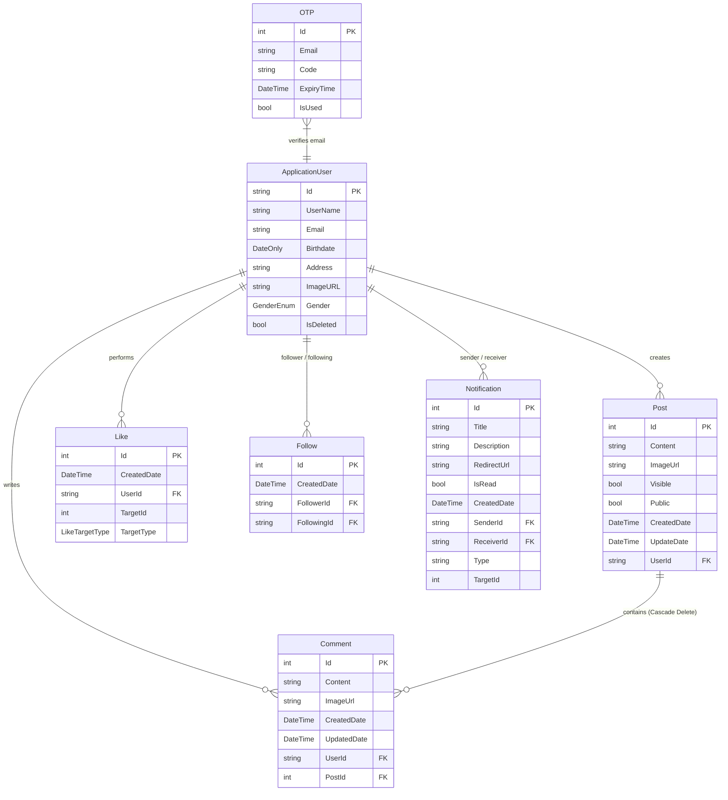

# BlogBook — Social Blogging Platform(Deployment => [http://vevien.tryasp.net/]

[](https://dotnet.microsoft.com/)
[](https://dotnet.microsoft.com/apps/aspnet)
[](https://learn.microsoft.com/en-us/ef/core/)
[](https://www.microsoft.com/sql-server)
[](https://dotnet.microsoft.com/apps/aspnet/signalr)
[](https://getbootstrap.com/)

A modern, full-featured **Social Blogging Platform** built with **ASP.NET Core 9.0 MVC**, **Entity Framework Core**, and **SignalR**. The platform provides a rich social media experience featuring two-step OTP-based user authentication, granular post visibility controls, polymorphic liking, nested comments, self-referencing user follow systems, real-time WebSocket notifications, live debounced user search, and soft account deletion middleware.

---

## 📋 Table of Contents

- [Architectural Highlights](#-architectural-highlights)
- [Key Features & Capabilities](#-key-features--capabilities)
- [Technical Stack](#-technical-stack)
- [Architecture & Project Structure](#-architecture--project-structure)
- [Database Schema & Entity Relationships](#-database-schema--entity-relationships)
- [Authentication & Security Implementation](#-authentication--security-implementation)
- [Core Workflows & Performance Engineering](#-core-workflows--performance-engineering)
- [Complete Controller & Endpoint Documentation](#-complete-controller--endpoint-documentation)
- [Setup & Configuration](#-setup--configuration)
- [How to Run](#-how-to-run)

---

## ⚡ Architectural Highlights

* **Layered MVC + Service Architecture**: Clean separation of concerns isolating HTTP Controllers, Business Logic Services (`Services/`), and Data Access (`Models/Data`).
* **N+1 Query Prevention**: Eliminates performance bottlenecks by executing inline projection subqueries (`.Select()`) for like counts and user interaction states in a single database round-trip.
* **Asynchronous Parallel Dispatching**: Broadcasts post creation notifications across all user followers in parallel using `Task.WhenAll`, avoiding sequential database query overhead.
* **Atomic Transactions & Disk Safety**: Implements explicit `IDbContextTransaction` boundaries for post CRUD operations ensuring disk image assets (`wwwroot/images/`) and SQL records roll back safely if an error occurs.
* **Polymorphic Liking System**: Uses a single unified `Like` table with `TargetId` and `TargetType` (`Post` / `Comment`) rather than maintaining fragmented join tables.
* **Soft Account Deletion Middleware**: Custom HTTP pipeline middleware (`DeleteAccountMiddleware`) intercepts active requests from soft-deleted accounts (`IsDeleted = true`), forcing immediate sign-out and session invalidation.

---

## ✨ Key Features & Capabilities

### 🔐 Authentication & Account Management
* **Two-Step Registration with Email Verification**: Form validation buffers user input in `HttpContext.Session["RegisterData"]`. Generates a 6-digit numeric OTP with a 5-minute expiration sent via SMTP. Account creation is finalized upon OTP confirmation.
* **OTP Password Reset Flow**: Registered users request a 6-digit verification code to reset credentials via secure Identity password reset tokens (`GeneratePasswordResetTokenAsync`).
* **Rate-Limited OTP Resend**: Protected by ASP.NET Core RateLimiter Middleware (`otpResendPolicy`), constraining OTP resend requests to a fixed window of **1 request per minute**.
* **Custom Identity Validation**: 
  * `CustomUserValidator`: Restricts usernames via regex (`^[\u0600-\u06FFa-zA-Z0-9 _.-]+$`), allowing Arabic and English alphanumeric characters alongside spaces and select punctuation (`_.-`).
  * `BirthdateValidation`: Custom model validation attribute enforcing a minimum age limit of **14 years**.
* **Security Stamp Invalidation**: Executes `UpdateSecurityStampAsync` upon password changes or account deletion, immediately invalidating active authentication cookies across all devices.
* **Soft Account Deletion**: Users can deactivate accounts without permanently purging relational history. Soft-deleted accounts are excluded from search, feeds, and follower metrics.

### 📝 Post Publishing & Dynamic Feed
* **Content & Media Uploads**: Posts support formatted rich text content (up to 1,000 characters) and image uploads saved to `wwwroot/images/post`.
* **Granular Visibility Controls**:
  * `Public`: Visible to all platform users on the global feed.
  * `Visible` (Private): Restricted strictly to approved followers and the post owner.
* **Chronological Friends Feed (`GetFriendsPosts`)**: Generates a unified stream aggregating:
  1. The authenticated user's own posts.
  2. Public posts from all active users.
  3. Private visible posts created by users whom the current user follows.
* **Paginated User Posts**: Paged gallery views (`PageResult<T>`) supporting custom page sizes and page numbers.

### ❤️ Polymorphic Liking Engine
* **Universal Liking**: Supports liking both posts and comments through a polymorphic target design.
* **AJAX Liking Toggle**: Interactive client-side toggle returning updated counts and state in real-time JSON format.
* **Like Roster Modal**: Endpoint (`/Like/GetPostLikes`) returning a JSON payload of users who liked a target post for modal UI presentation.
* **Smart Notification Sync**: Unliking an entity automatically deletes the associated notification record from the database.

### 💬 Comments System
* **Rich Commenting**: Supports text comments and image attachments on posts.
* **AJAX In-place Rendering**: Adding a comment immediately returns a rendered Razor partial (`_CommentPartial.cshtml`) for zero-page-refresh UI updates.
* **Cascade Cleanup**: Configured with `DeleteBehavior.Cascade` in `AppDbContext`, deleting all comments automatically when a post is removed.

### 👥 Follow & Social Network
* **User Following Dynamics**: Self-referencing relationship between `ApplicationUser` entities.
* **Composite Constraint**: Database unique index on `(FollowerId, FollowingId)` prevents duplicate follow entries.
* **Follower & Following Roster**: Dedicated views (`/Follow/GetFollowers` & `/Follow/GetFollowing`) listing user networks.
* **User Discovery / Explore**: Explore page (`/Profile/GetAll`) displaying platform users excluding already-followed and deleted users.

### 🔔 Real-Time SignalR Notifications
* **WebSocket Push Notifications**: Instant real-time alerts dispatched over SignalR (`NotificationHub` at `/notificationHub`).
* **Live UI Badge**: Client-side JavaScript listener increments the unread notification badge counter and prepends new notifications to the navigation dropdown in real time.
* **Paginated Notification Drawer**: `NotificationViewComponent` fetches notifications (5 items per page) with read status tracking and automatic navigation redirection upon click (`/Notification/Read`).
* **Thread-Safe DbContext Handling**: `NotificationService` instantiates dedicated `AppDbContext` instances from injected `DbContextOptions<AppDbContext>` to avoid thread contention during concurrent background operations.

### 🔍 Live User Search & Helpers
* **Debounced Live Search**: Client-side input listener with a **300ms JS debounce** queries `/Search/SearchUsers`, returning filtered user list partials (`_UsersListPartial.cshtml`).
* **Instagram-Style Relative Timestamps**: `TimeFormatter` utility formats timestamps dynamically ("15s ago", "4m ago", "2h ago", "Yesterday", "4d ago", "Oct 12").

---

## 🛠️ Technical Stack

| Layer | Technology / Package | Purpose |
| :--- | :--- | :--- |
| **Framework** | ASP.NET Core 9.0 MVC (`net9.0`) | Web Application Framework |
| **Language** | C# 13 | Primary Backend Programming Language |
| **Database & ORM** | SQL Server, EF Core 9.0.6 | Relational Database & ORM Mapping |
| **Identity & Security** | ASP.NET Core Identity | Authentication, Hashing, Token Generation |
| **Real-Time Engine** | ASP.NET Core SignalR | WebSocket Real-Time Event Dispatching |
| **Email Processing** | `System.Net.Mail` (SMTP) | Delivery of OTP Verification Emails |
| **Rate Limiting** | ASP.NET Core RateLimiter | Endpoint abuse prevention (`otpResendPolicy`) |
| **Session Management** | ASP.NET Core Session | Temporary cross-request registration buffering |
| **Frontend UI** | Bootstrap 5.3, FontAwesome 6, jQuery | Responsive UI, Modal Controls, AJAX |
| **WebSockets Client** | `@microsoft/signalr` | JavaScript SignalR Hub Connection |

---

## 🏗️ Architecture & Project Structure

The project strictly follows the **ASP.NET Core Layered MVC Pattern**, separating domain models, data access, business services, HTTP presentation, and real-time hubs.

```
Blog_Website/
├── Blog_Website.sln                  # Visual Studio Solution File
└── Blog_Website/                     # Main Web Project Root
    ├── Controllers/                  # HTTP Request Handling & View Mapping
    │   ├── AccountController.cs      # Login, Register, OTP verification, Reset Password
    │   ├── CommentController.cs      # Comment addition (AJAX) and deletion
    │   ├── FollowController.cs       # Follow/Unfollow toggles & user roster views
    │   ├── HomeController.cs         # Main feed feed rendering & error page
    │   ├── LikeController.cs         # Polymorphic like toggle (AJAX) & post likers modal
    │   ├── NotificationController.cs # Notification read tracking & paged loading
    │   ├── PostController.cs         # Post CRUD, details view, and user galleries
    │   ├── ProfileController.cs      # User profiles, profile edit, change password, soft delete
    │   └── SearchController.cs       # Debounced AJAX user live search
    ├── Services/                     # Business Logic Layer
    │   ├── IServices/                # Service Interfaces (Abstractions)
    │   │   ├── IAccountService.cs
    │   │   ├── ICommentService.cs
    │   │   ├── IEmailService.cs
    │   │   ├── IFollowService.cs
    │   │   ├── IImageService.cs
    │   │   ├── ILikeService.cs
    │   │   ├── INotificationService.cs
    │   │   ├── IPostService.cs
    │   │   ├── IProfileService.cs
    │   │   ├── ISearchService.cs
    │   │   └── IViewRenderService.cs
    │   └── [Implementations]         # AccountService, PostService, NotificationService, etc.
    ├── Models/                       # Domain Entities & Data Layer
    │   ├── Data/
    │   │   └── AppDbContext.cs       # EF Core DbContext, Fluent API mappings & relationships
    │   ├── Entities/                 # Core Domain Entities
    │   │   ├── ApplicationUser.cs   # Custom Identity user model
    │   │   ├── Post.cs              # Blog post entity
    │   │   ├── Comment.cs           # Comment entity
    │   │   ├── Like.cs              # Polymorphic like entity
    │   │   ├── Follow.cs            # Self-referencing user follow entity
    │   │   ├── Notification.cs      # Notification entity
    │   │   └── OTP.cs               # OTP record entity
    │   └── ErrorViewModel.cs         # Standardized error reporting DTO
    ├── ViewModel/                    # Feature-Scoped Data Transfer Objects (DTOs)
    │   ├── Account/                  # AccountViewModel, OtpViewModel, LoginViewModel, etc.
    │   ├── Comments/                 # CommentViewModel
    │   ├── Like/                     # LikeViewModel
    │   ├── Notification/             # AddNotificationViewModel
    │   ├── Posts/                    # PostViewModel, DisplayPostViewModel, PostDetailsViewModel
    │   └── Profile/                  # ProfileViewModel, EditViewModel, ChangePasswordViewModel
    ├── Middleware/
    │   └── DeleteAccountMiddleware.cs # Soft-delete request interceptor & session revoker
    ├── Hubs/
    │   └── NotificationHub.cs        # SignalR WebSocket Communication Endpoint
    ├── ViewComponents/
    │   └── NotificationViewComponent.cs # Paged real-time notification drawer UI component
    ├── CustomValidation/
    │   ├── BirthdateValidation.cs    # Min-age (14 years) validation attribute
    │   └── CustomUserValidator.cs    # Regex username character whitelist validator
    ├── Enums/
    │   ├── GenderEnum.cs             # Male, Female, Other
    │   ├── LikeTargetType.cs         # Post, Comment
    │   └── OtpFlow.cs                # Register, ForgetPassword
    ├── Generics/
    │   └── PageResult.cs             # Generic pagination wrapper class
    ├── Helpers/
    │   └── TimeFormatter.cs          # Relative Instagram-style timestamp formatter
    ├── Migrations/                   # EF Core Database Migration Files
    ├── Views/                        # Razor HTML Templates (.cshtml)
    ├── wwwroot/                      # Static Web Assets
    │   ├── images/
    │   │   ├── post/                 # Uploaded blog post images
    │   │   └── profile/              # Uploaded user profile avatars
    │   └── lib/                      # Bootstrap, jQuery, SignalR JS scripts
    └── Program.cs                    # Application Startup, DI Container, & Middleware Pipeline
```

---

## 🗄️ Database Schema & Entity Relationships

The application uses **SQL Server** managed via **Entity Framework Core Code-First Migrations**.



### Key Relational Rules & Model Configurations

1. **Polymorphic Liking (`Like`)**:
   * Uses `TargetId` (`int`) and `TargetType` (`LikeTargetType` enum: `Post = 0`, `Comment = 1`) to allow liking any target entity without introducing fragmented foreign key join tables.
2. **Self-Referencing Follow Relation (`Follow`)**:
   * Configured explicitly in `AppDbContext.OnModelCreating`:
     * `Follower`: Linked to `ApplicationUser` via `DeleteBehavior.NoAction`.
     * `Following`: Linked to `ApplicationUser` via `DeleteBehavior.Restrict`.
     * **Composite Unique Index**: `HasIndex(f => new { f.FollowerId, f.FollowingId }).IsUnique()` prevents duplicate follow relationships.
3. **Dual FK Notifications (`Notification`)**:
   * Dual foreign keys pointing to `ApplicationUser` (`SenderId` and `ReceiverId`) set to `DeleteBehavior.SetNull`. Uses generic `Type` ("Post", "Comment", "Follow", "Like") and `TargetId` fields for navigation routing.
4. **Cascade Comment Deletion**:
   * `Comment.Post` is configured with `DeleteBehavior.Cascade` ensuring post deletion automatically purges all associated comments.
5. **Soft Account Deletion**:
   * `ApplicationUser.IsDeleted` flag hides deleted accounts across queries (`!user.IsDeleted`), preserving historical database records and relational Integrity.

---

## 🔒 Authentication & Security Implementation

```
[ User Register Form ] ──> Validate Inputs & Credentials
                                │
                                ▼
                   [ Session Store: "RegisterData" ]
                                │
                                ▼
                 [ Generate 6-Digit OTP & Send Email ]
                                │
                                ▼
[ OTP Verification Form ] ──> Validate OTP Code & Expiry (5 Min)
                                │
                                ▼
               [ Account Created & Persistent Cookie Sign-In ]
```

* **Session-Buffered Registration**: User details are safely stored in `HttpContext.Session["RegisterData"]` prior to OTP verification, ensuring database persistence occurs only after email verification.
* **Rate-Limited Endpoints**: The `ResendOtp` endpoint is guarded by ASP.NET Core `RateLimiter` (`otpResendPolicy`), restricting resend requests to 1 permit per 60 seconds.
* **Soft Account Deletion Middleware**:
  ```csharp
  // DeleteAccountMiddleware.cs
  if (httpContext.User.Identity?.IsAuthenticated == true)
  {
      var user = await _userManager.GetUserAsync(httpContext.User);
      if (user != null && user.IsDeleted)
      {
          await _signInManager.SignOutAsync();
          httpContext.Response.Redirect("/Account/Login");
          return;
      }
  }
  await _next(httpContext);
  ```
* **Token & Security Stamp Revocation**: Password reset tokens are generated via `GeneratePasswordResetTokenAsync`. Calls to `UpdateSecurityStampAsync(user)` during credential modifications or deactivation force immediate cookie invalidation.

---

## 🚀 Core Workflows & Performance Engineering

### 1. Feed Aggregation Query (`GetFriendsPosts`)
Combines user-authored content, public posts, and private posts from followed users into a single chronological query using EF Core LINQ projections:
```csharp
var followedUsersId = (await _followService.GetFollowingsAsync(currentUserId))
    .Select(x => x.Id).ToList();

var posts = await _context.Posts
    .AsNoTracking()
    .Where(post => !post.ApplicationUser.IsDeleted &&
        (post.UserId == currentUserId || post.Public || (!post.Public && post.Visible && followedUsersId.Contains(post.UserId))))
    .OrderByDescending(x => x.CreatedDate)
    .Select(x => new DisplayPostViewModel
    {
        PostId = x.Id,
        Content = x.Content,
        ImageUrl = x.ImageUrl,
        CreatedDate = x.CreatedDate,
        UserId = x.UserId,
        User = x.ApplicationUser,
        IsLikedByCurrentUser = _context.Likes.Any(l => l.UserId == currentUserId && l.TargetId == x.Id),
        TempLikesCount = _context.Likes.Count(n => !n.ApplicationUser!.IsDeleted && n.TargetId == x.Id)
    })
    .ToListAsync();
```

### 2. Atomic DB Transactions & Disk Image Cleanups
`PostService` wraps complex multi-step operations inside database transactions:
```csharp
using var transaction = await _context.Database.BeginTransactionAsync();
try
{
    if (model.ImageFile != null)
        newPost.ImageUrl = await _imageService.UploadPostImageAsync(model.ImageFile);

    await _context.Posts.AddAsync(newPost);
    await _context.SaveChangesAsync();
    await transaction.CommitAsync();
}
catch
{
    await transaction.RollbackAsync();
    throw;
}
```

### 3. Parallel Background Notification Dispatching
When a user publishes a post, follower notifications are created in parallel using `Task.WhenAll`:
```csharp
var followers = await _followService.GetFollowersAsync(userId);
var tasks = followers.Where(x => !string.IsNullOrEmpty(x.Id))
    .Select(follower => _notifiService.CreateAsync(new AddNotificationViewModel
    {
        SenderId = userId,
        ReceiverId = follower.Id,
        Type = "Post",
        Title = $"{user.UserName} Add New Post",
        Description = $"{user.UserName} Add New Post",
        RedirectUrl = $"/Post/Details?postId={newPost.Id}"
    }));

await Task.WhenAll(tasks);
```

---

## 📌 Complete Controller & Endpoint Documentation

| Controller | Action / Method | Route | Description |
| :--- | :--- | :--- | :--- |
| **Account** | `GET/POST Register` | `/Account/Register` | Validates registration form and sends OTP code |
| | `GET/POST VerifyOtp` | `/Account/VerifyOtp` | Verifies 6-digit OTP code for registration or password reset |
| | `GET ResendOtp` | `/Account/ResendOtp` | Rate-limited OTP resend (1 request/minute) |
| | `GET/POST Login` | `/Account/Login` | User authentication & cookie session establishment |
| | `POST Logout` | `/Account/Logout` | Signs out user & returns JSON status |
| | `GET/POST ForgetPassword` | `/Account/ForgetPassword` | Initiates password reset flow via OTP email |
| | `GET/POST ResetPassword` | `/Account/ResetPassword` | Confirms password reset token and changes password |
| **Home** | `GET Index` | `/Home/Index` | Displays the aggregated chronological post feed |
| **Post** | `GET/POST Add` | `/Post/Add` | Renders and processes post creation (text + image) |
| | `GET/POST Edit` | `/Post/Edit` | Edits existing post content and updates image file |
| | `GET Delete` | `/Post/Delete` | Deletes post, image file, and associated comments atomically |
| | `GET Details` | `/Post/Details` | Displays post details along with comments |
| | `GET UserPosts` | `/Post/UserPosts` | Returns paginated list of posts for a specific user |
| **Comment** | `POST AddComment` | `/Comment/AddComment` | Adds comment via AJAX and returns partial view |
| | `GET Delete` | `/Comment/Delete` | Removes comment via AJAX |
| **Like** | `POST Toggle` | `/Like/Toggle` | Toggles post/comment like status via AJAX (returns JSON) |
| | `GET GetPostLikes` | `/Like/GetPostLikes` | Returns JSON array of users who liked a post |
| **Follow** | `POST AddFollow` | `/Follow/AddFollow` | Establishes follow relationship and sends notification |
| | `POST DeleteFollow` | `/Follow/DeleteFollow` | Removes follow relationship |
| | `GET GetFollowers` | `/Follow/GetFollowers` | Displays user followers list |
| | `GET GetFollowing` | `/Follow/GetFollowing` | Displays user followings list |
| **Profile** | `GET Profile` | `/Profile/Profile` | User profile page with gallery, stats, and posts count |
| | `GET/POST Edit` | `/Profile/Edit` | Updates user profile details and profile picture |
| | `GET GetAll` | `/Profile/GetAll` | User discovery / Explore page |
| | `GET/POST ChangePassword` | `/Profile/ChangePassword` | Changes account password & invalidates security stamp |
| | `POST DeleteAccount` | `/Profile/DeleteAccount` | Soft deletes user account (`IsDeleted = true`) |
| **Search** | `GET SearchUsers` | `/Search/SearchUsers` | Debounced AJAX live user search (returns partial) |
| **Notification**| `GET Read` | `/Notification/Read` | Marks notification as read and redirects to target URL |
| | `GET Load` | `/Notification/Load` | Loads paginated notifications via ViewComponent |

---

## ⚙️ Setup & Configuration

### Prerequisites
* [.NET 9.0 SDK](https://dotnet.microsoft.com/download/dotnet/9.0)
* [SQL Server](https://www.microsoft.com/sql-server) (LocalDB or full SQL Server instance)

### Configuration Settings (`appsettings.json`)
Configure your database connection string and SMTP mail settings in `appsettings.json`:

```json
{
  "Logging": {
    "LogLevel": {
      "Default": "Information",
      "Microsoft.AspNetCore": "Warning"
    }
  },
  "AllowedHosts": "*",
  "ConnectionStrings": {
    "constr": "Server=YOUR_SERVER_NAME; Database=BlogWebsite; Trusted_Connection=True; TrustServerCertificate=True"
  },
  "MailSettings": {
    "Email": "your-email@gmail.com",
    "Password": "your-app-password",
    "DisplayName": "BlogBook",
    "Host": "smtp.gmail.com",
    "Port": 587
  }
}
```

---

## 🏃 How to Run

1. **Clone the repository**:
   ```bash
   git clone https://github.com/Mahmoudssanad/Vevien-.git
   cd Blog_Website/Blog_Website
   ```

2. **Restore NuGet Packages**:
   ```bash
   dotnet restore
   ```

3. **Apply Database Migrations**:
   ```bash
   dotnet ef database update
   ```

4. **Run the Project**:
   ```bash
   dotnet run
   ```

5. **Launch in Browser**:
   Open your browser and navigate to:
   * `https://localhost:7049` or `http://localhost:5049`

---

## 📄 License

This project is open-source and available for showcase and educational purposes.
